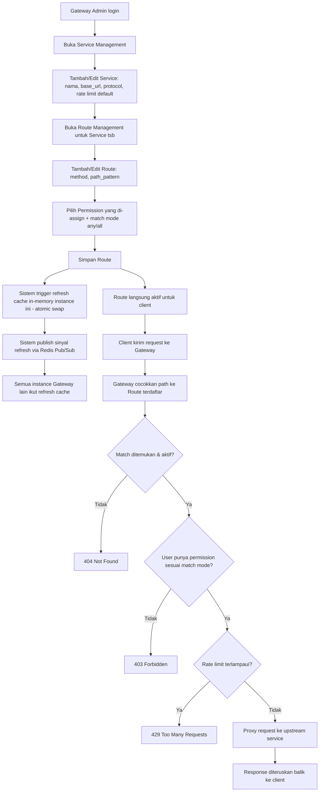

# 01 - Product Requirements Document (PRD)

## API Gateway — Service & Route Management

**Version:** 1.0.0
**Status:** Draft for Development

---

## 1. Project Overview

### Vision

API Gateway ini menjadi **titik masuk tunggal (single entry point)** untuk seluruh traffic HTTP yang menuju berbagai backend service internal organisasi. Alih-alih tiap service punya endpoint publik masing-masing, seluruh request masuk lewat Gateway ini, yang kemudian meneruskan (proxy) ke service tujuan berdasarkan konfigurasi yang bisa diatur secara dinamis — tanpa perlu rebuild/redeploy aplikasi Gateway setiap kali ada perubahan routing atau aturan akses.

### Background

Proyek ini dimulai dari base project boilerplate (Go + Gin + GORM + MySQL + Redis untuk backend; Vue + Pinia + Tailwind untuk frontend) yang sudah menyediakan modul fondasi: autentikasi (JWT RS256), manajemen User, Role, Permission (RBAC), Notification, JWKS, Health Check, dan File. Modul-modul ini **tidak diulang** dalam dokumen ini — dokumen ini fokus pada **fitur baru** yang menjadikan boilerplate tersebut sebuah API Gateway sungguhan: **Service Management**, **Route Management**, dan **Dynamic Proxy Engine**.

Ide awal (dynamic routing via database, load ke memory, refresh berkala) berasal dari sesi brainstorming teknis (lihat `Ai.md` di root project) — dokumen tersebut **hanya referensi ide awal**, bukan spesifikasi final. Desain final di dokumen ini sudah diperluas: dukungan permission many-to-many dengan mode `any`/`all`, path pattern dengan parameter dinamis dan wildcard, rate limiting dinamis, sinkronisasi cache multi-instance via Redis Pub/Sub, health check upstream otomatis, dan audit trail. Selain itu, dokumen ini juga mencakup penyempurnaan kecil pada modul User existing: **Status** (Active/Suspend) dan **Account Lock** otomatis.

### Specific Goals

1. Admin dapat mendaftarkan service/upstream baru (nama, base URL, protokol) tanpa menyentuh kode Go.
2. Admin dapat mendefinisikan aturan routing (method + path pattern) per service, lengkap dengan siapa yang boleh mengakses (reuse RBAC Permission yang sudah ada).
3. Perubahan konfigurasi Service/Route **efektif langsung** (real-time) di seluruh instance Gateway yang berjalan, tanpa restart, dan cache in-memory yang sudah ada **tidak pernah kosong/hilang sesaat** selama proses refresh berlangsung (baik sukses maupun gagal).
4. Gateway tetap dapat melayani traffic REST dan WebSocket lewat satu mekanisme proxy yang sama.
5. Admin punya visibilitas kesehatan upstream (Up/Down) tiap service terdaftar.
6. Setiap perubahan konfigurasi tercatat (audit trail) untuk keperluan investigasi/compliance.
7. Admin (Super Admin) dapat mengatur status akun User (Active/Suspend) dan sistem dapat mengunci sementara akun User yang mengalami percobaan login gagal berulang kali, terpisah dari status administratif.

---

## 2. Target Audience

### Persona 1 — Platform/Backend Engineer ("Andi")

- **Peran:** Bertanggung jawab menghubungkan service-service internal baru ke Gateway.
- **Pain point saat ini:** Setiap ada service baru atau perubahan endpoint, harus edit kode Gateway, rebuild, redeploy — proses lambat dan berisiko downtime.
- **Kebutuhan:** UI/API untuk mendaftarkan service & route baru dalam hitungan menit, dengan validasi jelas sebelum publish.

### Persona 2 — Gateway Administrator ("Budi")

- **Peran:** Mengatur siapa boleh akses endpoint apa lewat Gateway (governance).
- **Pain point saat ini:** Tidak ada kontrol akses terpusat per endpoint; otorisasi tersebar di masing-masing service.
- **Kebutuhan:** Kemampuan mengaitkan permission (role-based) ke route tertentu, termasuk kasus endpoint sensitif yang butuh lebih dari satu permission sekaligus.

### Persona 3 — Auditor/Support ("Citra")

- **Peran:** Investigasi insiden (misal "kenapa endpoint ini tiba-tiba berubah perilakunya").
- **Pain point saat ini:** Tidak ada histori perubahan konfigurasi routing.
- **Kebutuhan:** Read-only akses ke daftar service/route dan audit trail perubahan.

---

## 3. User Stories

| ID | Role | Requirement | Benefit | Priority |
|----|------|-------------|---------|----------|
| US-01 | Gateway Admin | Saya ingin mendaftarkan service baru (nama, base URL, protokol) | Supaya service baru bisa langsung diproxy tanpa ubah kode | Must |
| US-02 | Gateway Admin | Saya ingin mengaktifkan/menonaktifkan service tertentu | Supaya bisa cepat memutus akses ke service bermasalah | Must |
| US-03 | Gateway Admin | Saya ingin mendefinisikan route (method + path pattern) untuk suatu service | Supaya hanya path yang diizinkan yang bisa diakses lewat Gateway | Must |
| US-04 | Gateway Admin | Saya ingin mengaitkan satu atau lebih permission ke suatu route, dan memilih apakah user butuh salah satu atau semua permission tersebut | Supaya kontrol akses endpoint bisa fleksibel dari yang longgar sampai sangat ketat | Must |
| US-05 | End User (client aplikasi) | Saya ingin request saya diteruskan ke service tujuan yang benar secara transparan | Supaya saya tidak perlu tahu alamat internal tiap service | Must |
| US-06 | Gateway Admin | Saya ingin perubahan konfigurasi Service/Route langsung berlaku tanpa restart Gateway | Supaya operasional tidak terganggu saat ada perubahan | Must |
| US-07 | Platform Engineer | Saya ingin Gateway tetap konsisten walau berjalan di banyak instance/replica | Supaya tidak ada instance yang "ketinggalan" konfigurasi | Should |
| US-08 | Gateway Admin | Saya ingin mengatur rate limit berbeda per service atau bahkan per route tertentu | Supaya endpoint sensitif (misal login, payment) bisa dibatasi lebih ketat | Should |
| US-09 | Gateway Admin | Saya ingin melihat status kesehatan (Up/Down) tiap service terdaftar | Supaya bisa cepat tahu kalau ada upstream yang bermasalah | Should |
| US-11 | Auditor | Saya ingin melihat histori perubahan Service/Route (siapa, apa, kapan) | Supaya bisa investigasi insiden terkait perubahan konfigurasi | Should |
| US-12 | Platform Engineer | Saya ingin Gateway bisa proxy koneksi WebSocket, bukan cuma REST | Supaya service real-time (chat/notifikasi) juga bisa lewat Gateway | Must |
| US-13 | Platform Engineer | Saya ingin Gateway bisa proxy gRPC di masa depan | Supaya service berbasis gRPC juga bisa dikonsolidasi lewat Gateway | Won't (backlog) |
| US-14 | Super Admin | Saya ingin mengatur status User (Active/Suspend) | Supaya bisa menonaktifkan akses user tanpa menghapus akunnya | Must |
| US-15 | Super Admin | Saya ingin akun User terkunci otomatis sementara setelah gagal login berkali-kali, dan bisa membuka kuncinya secara manual kalau perlu | Supaya akun terlindungi dari brute-force tanpa harus admin selalu memantau real-time | Should |

> **Catatan:** US-10 (Route Testing Tool) yang sebelumnya direncanakan **dibatalkan/dihapus dari scope** — lihat `CHANGELOG.md` v1.1.0. ID US-10 sengaja tidak dipakai ulang untuk menjaga jejak histori.

---

## 4. Key Features & MoSCoW

| Feature | MoSCoW | Catatan |
|---------|--------|---------|
| Service CRUD (nama, base_url, protocol, aktif/nonaktif, rate limit default) | Must | Fondasi — tanpa ini tidak ada upstream terdaftar |
| Route CRUD (method, path pattern, aktif/nonaktif) | Must | Fondasi — tanpa ini tidak ada aturan proxy |
| Route ↔ Permission many-to-many + match mode (`any`/`all`) | Must | Reuse modul Permission existing |
| Dynamic Proxy Engine (REST) | Must | Inti Gateway |
| WebSocket proxy support | Must | Satu code path dengan REST (biaya implementasi rendah) |
| Refresh strategy: on-save trigger + periodic fallback + manual refresh | Must | Supaya perubahan efektif tanpa restart |
| Redis Pub/Sub multi-instance cache sync | Should | Dibutuhkan karena Gateway direncanakan multi-instance |
| Rate limiting dinamis (default service + override route) | Should | Fallback: rate limit statis dari `.env` (sudah ada di boilerplate) |
| Health check upstream otomatis (Up/Down) | Should | Observability, non-blocking fungsi utama |
| Audit trail perubahan Service/Route | Should | Compliance/tracing, non-blocking fungsi utama |
| User Status (Active/Suspend) | Must | Delta modul User existing — dikelola Super Admin lewat permission `user.edit` yang sudah ada |
| User Account Lock (otomatis + manual unlock) | Should | Delta modul User existing — terpisah dari Status, lihat FSD §6 |
| gRPC proxy support | Could | Transport terpisah (HTTP/2), dikerjakan paling akhir |
| Import/Export config Service+Route (JSON/YAML) | Could | Backup/restore & migrasi antar environment |
| Circuit breaker per service | Won't (v1) | Dipertimbangkan untuk versi berikutnya |
| Request/response transform header (X-Forwarded-User, X-Request-ID) | Won't (v1) | Dipertimbangkan untuk versi berikutnya |
| Route Testing Tool di UI | **Dihapus** | Dibatalkan dari scope per permintaan user (v1.1.0) — lihat CHANGELOG |

---

## 5. High-Level User Flow

---

## 6. Non-Functional Requirements

- **Security:** Seluruh endpoint Management (Service/Route CRUD) wajib JWT + permission check (RBAC existing). Traffic yang diproxy tetap melalui JWT middleware Gateway sebelum diteruskan ke upstream. Base URL upstream tidak boleh diekspos ke client (hanya path relatif Gateway yang publik).
- **Scalability:** Gateway harus tetap konsisten walau berjalan multi-instance (lihat Redis Pub/Sub, §TDD). Refresh cache tidak boleh membebani DB — query dilakukan hanya saat trigger (on-save/periodic/manual), bukan per-request.
- **Performance:** Path matching dilakukan terhadap data in-memory (bukan query DB per request) agar overhead proxy minimal. Target overhead tambahan dari matching+permission check < 5ms per request (di luar latency upstream).
- **Portability:** Desain infrastruktur harus container-based generik — bisa jalan di Docker biasa, Kubernetes, maupun OpenShift (OCP) tanpa bergantung API spesifik platform tertentu.
- **Reliability:** Refresh cache routing menggunakan mekanisme **atomic swap** (bangun snapshot baru penuh di struktur terpisah, baru ditukar setelah selesai) — route yang sudah ada di cache **tidak pernah kosong/hilang sesaat**, baik saat refresh sukses maupun gagal. Kegagalan refresh (misal DB sementara tidak bisa diakses) membuat Gateway tetap memakai data lama sampai refresh berikutnya berhasil.
- **Security (Account Protection):** Akun User yang mengalami percobaan login gagal berturut-turut dalam ambang batas tertentu akan dikunci otomatis (Lock) untuk jangka waktu tertentu, terpisah dari Status administratif (Active/Suspend) yang dikontrol admin.

---

## 7. Success Metrics

- Waktu dari "admin simpan perubahan Route" sampai "perubahan efektif di semua instance" < 2 detik (via Pub/Sub), dengan fallback periodic ≤ 60 detik kalau Pub/Sub gagal terkirim.
- 100% request yang diproxy melalui pengecekan permission (tidak ada bypass).
- Downtime akibat perubahan konfigurasi routing (tanpa restart) = 0.

---

## 8. Constraints & Assumptions

- Redis sudah tersedia dan `REDIS_ENABLED=true` di environment (dependency sudah ada di boilerplate, tidak menambah dependency baru).
- Autentikasi (JWT) dan modul RBAC (User/Role/Permission) sudah tersedia dari base project dan **direuse**, tidak dibuat ulang.
- Database menggunakan MySQL + GORM sesuai konfigurasi base project.
- Deployment mungkin multi-instance (Docker scale/Kubernetes/OpenShift) — desain harus mengasumsikan kemungkinan ini sejak awal.
- gRPC dan fitur Could-have lain (import/export config) di luar scope implementasi v1, hanya dicatat sebagai arah pengembangan berikutnya.
