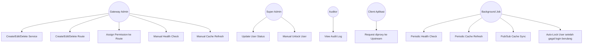
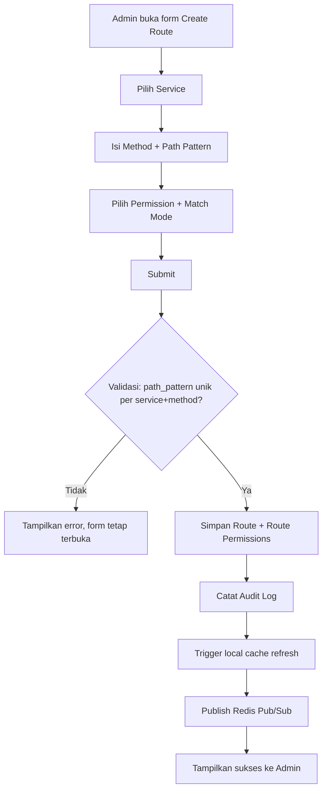
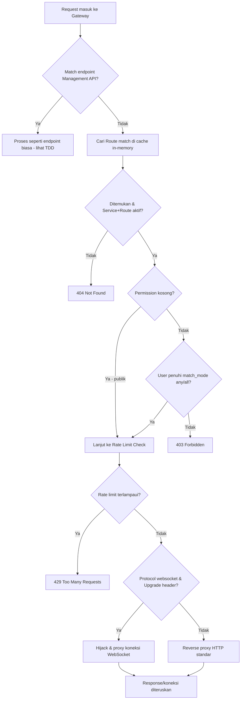
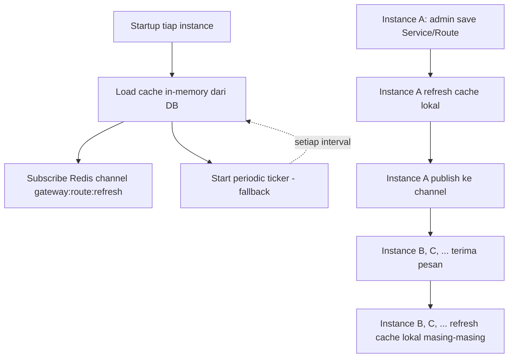
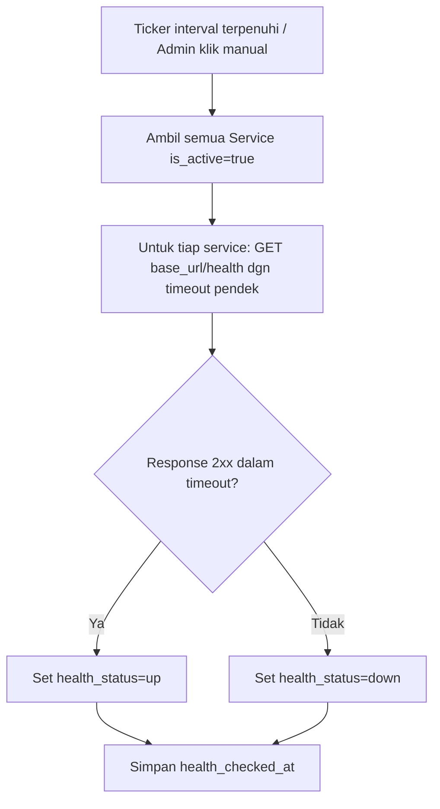
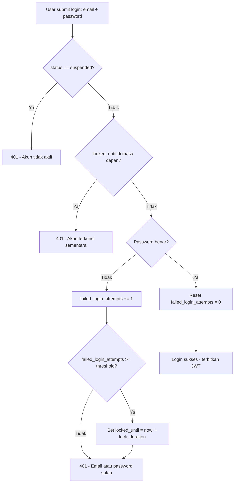

# 02 - Functional Specification Document (FSD)

## API Gateway — Service & Route Management

---

## 1. Functional Hierarchy

1. Service Management
   1.1. Create Service
   1.2. Edit Service
   1.3. Delete Service
   1.4. List/View Service
   1.5. Toggle Active/Inactive
   1.6. Manual Health Check Trigger
2. Route Management
   2.1. Create Route
   2.2. Edit Route
   2.3. Delete Route
   2.4. List/View Route
   2.5. Assign Permissions to Route (many-to-many + match mode)
3. Dynamic Proxy Engine
   3.1. Request Matching (path + method → Route)
   3.2. Permission Resolution (any/all)
   3.3. Rate Limit Enforcement (dynamic)
   3.4. REST Proxying
   3.5. WebSocket Proxying
   3.6. Cache Refresh (on-save, periodic, manual)
   3.7. Multi-instance Sync (Redis Pub/Sub)
4. Health Check Upstream (background job)
5. Audit Trail
   5.1. Record Change
   5.2. View Audit Log
6. User Account Status & Lock (Delta Modul User Existing)
   6.1. Update User Status (Active/Suspend)
   6.2. Automatic Account Lock (Failed Login Threshold)
   6.3. Manual Unlock

---

## 2. Detailed Functional Requirements

### §2.1 Create Service

- **Business Logic:** Admin mendaftarkan upstream baru dengan `name` (unik), `base_url`, `base_path` (unik, wajib — prefix path tetap yang membedakan Service ini dari Service lain, misal `/order`; lihat §2.13), `protocol` (`http` atau `websocket`), `rate_limit_per_minute` (opsional, null = pakai default global dari `.env`), `is_active` (default `true`).
- **Pre-conditions:** User memiliki permission `service.create`. `name` belum dipakai service lain (termasuk yang soft-deleted dicek unik pada active record). `base_path` juga wajib unik secara global (bukan hanya terhadap `name`), diawali `/`, tidak diakhiri `/`, dan tidak mengandung wildcard (`*`) atau parameter (`:`).
- **Post-conditions:** Record baru tersimpan di `gateway_services`. Audit log entry dibuat (`action=create`). Cache in-memory proxy engine di-refresh (service baru belum berdampak ke traffic sampai ada Route yang mengarah ke sana).

### §2.2 Edit Service

- **Business Logic:** Admin mengubah `name`, `base_url`, `base_path`, `protocol`, `rate_limit_per_minute`, atau `is_active` dari service yang sudah ada. `base_path` tetap harus unik secara global setelah perubahan.
- **Pre-conditions:** Permission `service.edit`. Service dengan `id` tersebut ada dan belum dihapus (`deleted_at IS NULL`).
- **Post-conditions:** Record ter-update. Audit log entry (`action=update`, menyimpan before/after value kolom yang berubah). Trigger refresh cache (on-save) + publish Redis Pub/Sub. Jika `is_active` diubah ke `false`, seluruh Route di bawah service ini otomatis dianggap tidak aktif oleh Proxy Engine (tanpa mengubah `is_active` pada tiap Route).

### §2.3 Delete Service

- **Business Logic:** Soft-delete service. Service yang masih memiliki Route aktif tidak bisa langsung dihapus — admin harus menonaktifkan/menghapus Route terkait dahulu, ATAU sistem menampilkan konfirmasi eksplisit "Service ini masih punya N route aktif, tetap hapus?" yang men-cascade soft-delete ke seluruh Route di bawahnya.
- **Pre-conditions:** Permission `service.delete`.
- **Post-conditions:** `deleted_at` terisi pada `gateway_services` (dan cascade ke `gateway_routes` terkait bila dikonfirmasi). Audit log (`action=delete`). Refresh cache + publish Pub/Sub.

### §2.4 List/View Service

- **Business Logic:** Menampilkan daftar service dengan pagination, filter (`is_active`, `protocol`, `health_status`), dan search by `name`. View detail menampilkan juga daftar Route di bawah service tsb (ringkas).
- **Pre-conditions:** Permission `service.index`.
- **Post-conditions:** Tidak ada perubahan data (read-only).

### §2.5 Toggle Active/Inactive

- **Business Logic:** Shortcut UI untuk mengubah `is_active` tanpa membuka form edit penuh.
- **Pre-conditions:** Permission `service.edit` (aksi ini tetap dianggap bagian dari edit, bukan permission terpisah).
- **Post-conditions:** Sama seperti §2.2 (khusus kolom `is_active`).

### §2.6 Manual Health Check Trigger

- **Business Logic:** Admin memicu pengecekan kesehatan service secara langsung (tidak menunggu jadwal background job). Sistem mengirim request `GET {base_url}/health` (atau path health check yang dikonfigurasi) dengan timeout pendek (misal 5 detik).
- **Pre-conditions:** Permission `service.health-check`. Service `is_active = true`.
- **Post-conditions:** `health_status` (`up`/`down`) dan `health_checked_at` ter-update. Tidak membuat audit log (bukan perubahan konfigurasi, hanya status observasi).

### §2.7 Create Route

- **Business Logic:** Admin mendefinisikan aturan routing di bawah suatu Service: `method` (`GET`/`POST`/`PUT`/`PATCH`/`DELETE`/`*` untuk semua method), `path_pattern` (mendukung literal `/user`, parameter dinamis `/user/:id`, dan wildcard `/user/*`), `permission_match_mode` (`any` default atau `all`), `rate_limit_per_minute` (opsional override), daftar `permissions` (request field berisi array permission id, boleh kosong = publik, tidak butuh permission tambahan selain autentikasi Gateway standar).
- **Pre-conditions:** Permission `route.create`. Kombinasi (`service`, `method`, `path_pattern`) harus unik (tidak boleh ada duplikat persis). `path_pattern` harus diawali `/`.
- **Post-conditions:** Record baru di `gateway_routes` + entry di `gateway_route_permissions` untuk tiap permission yang dipilih. Audit log (`action=create`). Refresh cache (on-save + Pub/Sub).

### §2.8 Edit Route

- **Business Logic:** Mengubah `method`, `path_pattern`, `permission_match_mode`, `rate_limit_per_minute`, `is_active`, atau daftar permission yang di-assign.
- **Pre-conditions:** Permission `route.edit`. Route ada dan belum dihapus.
- **Post-conditions:** Record + junction table ter-update (permission lama yang tidak dipilih lagi dihapus dari `gateway_route_permissions`, yang baru ditambahkan). Audit log (`action=update`, before/after termasuk daftar permission). Refresh cache (on-save + Pub/Sub).

### §2.9 Delete Route

- **Business Logic:** Soft-delete satu Route spesifik.
- **Pre-conditions:** Permission `route.delete`.
- **Post-conditions:** `deleted_at` terisi. Audit log (`action=delete`). Refresh cache (on-save + Pub/Sub).

### §2.10 List/View Route

- **Business Logic:** Menampilkan daftar Route (filter by `service`, `method`, `is_active`), termasuk daftar permission yang ter-assign dan match mode-nya.
- **Pre-conditions:** Permission `route.index`.
- **Post-conditions:** Read-only.

### §2.11 Assign Permissions to Route

- **Business Logic:** Bagian dari form Create/Edit Route — admin memilih satu atau lebih Permission (dari daftar Permission yang sudah ada di modul Permission Management existing) dan menentukan `permission_match_mode`:
  - `any` — user lolos kalau punya **salah satu** permission yang di-assign.
  - `all` — user harus punya **semua** permission yang di-assign.
- **Pre-conditions:** Permission yang dipilih harus valid/ada di tabel `permissions`. Minimal 0 permission (boleh kosong = publik).
- **Post-conditions:** Entry `gateway_route_permissions` mencerminkan pilihan admin (full replace, bukan incremental append, untuk mencegah sisa data usang).

> **§2.12 dihapus.** Fitur "Test Route (Route Testing Tool)" dibatalkan dari scope per keputusan v1.1.0 (lihat `CHANGELOG.md`). Nomor §2.12 sengaja tidak dipakai ulang agar referensi silang di TDD/ITL untuk §2.13 dan seterusnya tetap valid.

### §2.13 Request Matching (Dynamic Proxy Engine)

- **Business Logic:** Untuk setiap request masuk ke Gateway yang tidak match ke endpoint Management API manapun, sistem mencari Route yang cocok berdasarkan `method` + (`service.base_path` + `route.path_pattern`, digabung jadi satu full path) dari cache in-memory — `path_pattern` bersifat relatif terhadap `base_path` milik Service-nya. Karena `base_path` wajib unik per Service dan `(method, path_pattern)` wajib unik dalam satu Service, full path hasil gabungan otomatis unik secara global — tidak mungkin dua Service berbeda punya full path yang sama persis. Algoritma specificity: literal segment > parameter dinamis (`:id`) > wildcard (`*`); path dengan jumlah segmen literal lebih banyak menang atas yang lebih sedikit. Hanya Route dari Service yang `is_active = true` DAN Route itu sendiri `is_active = true` yang dipertimbangkan.
- **Pre-conditions:** Cache in-memory sudah ter-load (minimal 1x saat startup).
- **Post-conditions:** Jika ditemukan match → lanjut ke §2.14 (permission check). Jika tidak → response `404 Not Found`.

### §2.14 Permission Resolution

- **Business Logic:** Setelah Route ditemukan, sistem ambil daftar permission ter-assign + `permission_match_mode`. Jika daftar permission kosong → request dianggap publik (lanjut, asalkan tetap lolos autentikasi JWT standar Gateway). Jika tidak kosong → evaluasi `any`/`all` terhadap permission milik user (reuse `helpers.Access` yang sudah ada, method `HasPermission` untuk mode `any`; perlu method baru `HasAllPermissions` untuk mode `all`).
- **Pre-conditions:** User sudah terautentikasi (JWT valid, middleware existing).
- **Post-conditions:** Lolos → lanjut ke §2.15 (rate limit). Gagal → response `403 Forbidden`.

### §2.15 Rate Limit Enforcement (Dynamic)

- **Business Logic:** Tentukan limit efektif: pakai `rate_limit_per_minute` dari Route (kalau di-set), kalau tidak → pakai `rate_limit_per_minute` dari Service, kalau tidak → pakai default global dari `.env` (`RATE_LIMIT_REQUESTS`/`RATE_LIMIT_WINDOW`, middleware existing). Reuse middleware `ratelimit` yang sudah ada, hanya sumber konfigurasi limit-nya dijadikan dinamis dari resolved Route/Service.
- **Pre-conditions:** Route/Service sudah teridentifikasi.
- **Post-conditions:** Lolos → lanjut proxy (§2.16/§2.17). Melebihi limit → response `429 Too Many Requests`.

### §2.16 REST Proxying

- **Business Logic:** Request diteruskan ke `{service.base_url}{path asli}` menggunakan `httputil.ReverseProxy`. `base_path` hanya dipakai untuk pencocokan Route di sisi Gateway (§2.13) — path asli yang diterima dari client (termasuk prefix `base_path`-nya) diteruskan apa adanya ke upstream, tidak di-strip. Response (status, header, body) diteruskan balik ke client apa adanya.
- **Pre-conditions:** Request lolos §2.13–§2.15.
- **Post-conditions:** Response upstream diteruskan ke client. Jika upstream timeout/unreachable → response `502 Bad Gateway`.

### §2.17 WebSocket Proxying

- **Business Logic:** Jika request memiliki header `Upgrade: websocket` dan Service tujuan berprotokol `websocket`, `httputil.ReverseProxy` menangani hijack koneksi secara otomatis (built-in Go sejak 1.12) — tidak ada logic tambahan berbeda dari REST proxying di level kode, hanya dipastikan header `Connection`/`Upgrade` tidak di-strip oleh middleware apapun di jalur request.
- **Pre-conditions:** Sama seperti §2.16, ditambah Service `protocol = websocket`.
- **Post-conditions:** Koneksi WebSocket ter-establish end-to-end melalui Gateway.

### §2.18 Cache Refresh — On-Save Trigger

- **Business Logic:** Setiap kali Create/Update/Delete Service atau Route berhasil commit ke DB, service layer memanggil `RouteManager.Refresh()` pada instance yang menangani request tsb, lalu `Publish` sinyal ke Redis channel `gateway:route:refresh`. `Refresh()` membangun snapshot route baru secara lengkap di struktur data terpisah, baru menukarnya (atomic swap) ke cache aktif setelah build selesai sukses — cache lama yang sedang dipakai traffic **tidak pernah dikosongkan/dihapus dulu** sebelum data baru siap (lihat TDD §5 Konkurensi & Caching).
- **Pre-conditions:** Perubahan berhasil commit ke DB.
- **Post-conditions:** Cache in-memory instance ybs langsung ter-update (< 1 detik) tanpa ada window waktu di mana route yang sudah ada menjadi hilang/kosong.

### §2.19 Cache Refresh — Periodic Fallback

- **Business Logic:** Background ticker (interval dikonfigurasi via `.env`, default 60 detik) yang me-refresh cache in-memory secara independen dari trigger on-save, sebagai jaring pengaman.
- **Pre-conditions:** Aplikasi sudah running.
- **Post-conditions:** Cache tetap eventually-consistent walau ada kegagalan trigger on-save/Pub/Sub.

### §2.20 Cache Refresh — Manual Trigger

- **Business Logic:** Endpoint khusus (`POST /api/gateway/cache/refresh`) yang dipanggil admin dari UI untuk memaksa refresh cache instance yang menerima request tsb.
- **Pre-conditions:** Permission `route.create` **atau** `route.edit` (salah satu cukup — tidak ada permission `gateway.cache-refresh` terpisah; siapapun yang boleh membuat/mengubah Route otomatis boleh memicu refresh manual).
- **Post-conditions:** Cache ter-refresh (atomic swap, lihat §2.18) + tetap publish Pub/Sub (supaya instance lain ikut, bukan cuma instance yang menerima klik tombol).

### §2.21 Multi-instance Sync (Redis Pub/Sub)

- **Business Logic:** Setiap instance Gateway subscribe ke channel Redis `gateway:route:refresh` saat startup (goroutine terpisah, berjalan sepanjang lifetime aplikasi). Ketika menerima pesan apapun di channel tsb, instance langsung memanggil `RouteManager.Refresh()` lokal.
- **Pre-conditions:** `REDIS_ENABLED=true`. Koneksi Redis tersedia.
- **Post-conditions:** Semua instance konsisten dalam hitungan milidetik setelah salah satu instance melakukan publish. Jika koneksi Redis putus sementara, periodic fallback (§2.19) tetap menjaga eventual consistency.

### §2.22 Health Check Upstream (Background Job)

- **Business Logic:** Job berjalan periodik (interval dikonfigurasi, default tiap 60 detik, menggunakan `asynq` scheduler yang sudah ada di boilerplate) — untuk tiap Service `is_active = true`, kirim `GET {base_url}/health` dengan timeout pendek. Update `health_status` (`up` jika response 2xx dalam timeout, `down` jika sebaliknya/timeout) dan `health_checked_at`.
- **Pre-conditions:** Service aktif terdaftar.
- **Post-conditions:** Status tersimpan, ditampilkan di UI Service Management. **Tidak** otomatis menonaktifkan Route/Service (keputusan tetap di tangan admin) — status ini murni informatif untuk v1.

### §2.23 Record Change (Audit Trail)

- **Business Logic:** Setiap Create/Update/Delete pada Service atau Route menghasilkan 1 entry di `gateway_audit_logs`: `entity_type`, `entity_id`, `action`, `actor_user_id` (dari JWT context), `changes` (JSON before/after untuk update, full snapshot untuk create/delete), `created_at`.
- **Pre-conditions:** Operasi CRUD berhasil.
- **Post-conditions:** Entry tersimpan, immutable (tidak ada update/delete pada audit log itu sendiri).

### §2.24 View Audit Log

- **Business Logic:** Daftar audit log dengan filter `entity_type`, `entity`, `actor`, rentang tanggal. Read-only.
- **Pre-conditions:** Permission `audit.index`.
- **Post-conditions:** Tidak ada perubahan data.

### §2.25 Update User Status (Active/Suspend)

- **Business Logic:** Delta pada modul User existing — menambahkan kolom `status` (enum `active`/`suspended`, default `active`) yang dikontrol manual oleh admin, terpisah total dari mekanisme Lock (§2.26). User dengan status `suspended` **tidak bisa login** (ditolak saat autentikasi, sebelum credential bahkan divalidasi lebih lanjut — pesan generik agar tidak bocor informasi apakah credential benar).
- **Pre-conditions:** Permission `user.edit` (permission existing, tidak ada permission baru khusus — reuse pola yang sudah ada di modul User).
- **Post-conditions:** Kolom `status` ter-update. Jika status diubah ke `suspended` sementara user sedang punya sesi aktif (JWT valid), sesi tersebut **tidak otomatis di-revoke** di v1 (token tetap valid sampai expired) — dicatat sebagai potential future improvement (token blacklist), bukan bagian dari v1.

### §2.26 Automatic Account Lock (Failed Login Threshold)

- **Business Logic:** Setiap percobaan login gagal (password salah) menambah counter `failed_login_attempts` pada user terkait. Setelah mencapai ambang batas (`AUTH_MAX_FAILED_LOGIN_ATTEMPTS`, default `5`), akun otomatis terkunci: `locked_until` diisi `now() + AUTH_LOCK_DURATION_MINUTES` (default `15` menit). Selama `locked_until > now()`, login ditolak walau password benar, dengan pesan generik "Akun terkunci sementara, coba lagi nanti" (tidak menyebutkan durasi persis untuk mencegah timing enumeration). Login yang **berhasil** me-reset `failed_login_attempts` ke `0`.
- **Pre-conditions:** Kolom `failed_login_attempts` (int, default `0`) dan `locked_until` (datetime, nullable) tersedia pada tabel `users`.
- **Post-conditions:** Setelah `locked_until` terlewati, counter otomatis dianggap reset pada percobaan login berikutnya (tidak perlu job terpisah — cukup dicek at read-time saat proses login). Status **Lock** ini independen dari kolom `status` (§2.25) — user yang `status=active` tetap bisa ter-lock otomatis, dan user yang sedang `locked` tetap berstatus `active` (bukan `suspended`) di kolom `status`.

### §2.27 Manual Unlock

- **Business Logic:** Admin dapat membuka kunci akun secara manual sebelum `locked_until` terlewati (misal user melapor lupa password lalu sudah reset, tapi masih dalam window lock). Aksi ini men-set `locked_until = NULL` dan `failed_login_attempts = 0`.
- **Pre-conditions:** Permission `user.edit`. Akun memang sedang dalam kondisi terkunci (`locked_until` di masa depan).
- **Post-conditions:** User bisa langsung login kembali (asalkan `status=active` dan credential benar).

---

## 3. User Interaction & Screen Elements

### §3.1 Create/Edit Service Form

| Element Name | Type | Validation Rules |
|---|---|---|
| Name | Text input | Required, min 3, max 100, unik (case-insensitive) |
| Base URL | Text input (URL) | Required, harus valid URL format (`http://` atau `https://`) |
| Protocol | Select (`http`/`websocket`) | Required, default `http` |
| Rate Limit per Minute | Number input | Optional, min 1 jika diisi, kosong = pakai default global |
| Is Active | Toggle/switch | Default `true` |

### §3.2 Service List/Table

| Element Name | Type | Validation Rules |
|---|---|---|
| Search by Name | Text input | Optional, debounce 300ms |
| Filter: Protocol | Select | Optional (`all`/`http`/`websocket`) |
| Filter: Is Active | Select | Optional (`all`/`active`/`inactive`) |
| Filter: Health Status | Select | Optional (`all`/`up`/`down`/`unknown`) |
| Table Columns | Table | Name, Base URL, Protocol, Rate Limit, Health Status (badge warna), Is Active, Actions (Edit/Delete/Health Check/View Routes) |

### §3.3 Create/Edit Route Form

| Element Name | Type | Validation Rules |
|---|---|---|
| Service | Select (searchable) | Required, harus Service yang ada & tidak dihapus |
| Method | Select (`GET`/`POST`/`PUT`/`PATCH`/`DELETE`/`*`) | Required |
| Path Pattern | Text input | Required, harus diawali `/`, boleh mengandung `:param` dan `*` di akhir segmen, unik per (service, method) |
| Permission Match Mode | Radio (`any`/`all`) | Required, default `any` |
| Permissions (field request: `permissions`) | Multi-select (searchable, dari daftar Permission existing) | Optional (kosong = publik) |
| Rate Limit per Minute (override) | Number input | Optional, min 1 jika diisi |
| Is Active | Toggle/switch | Default `true` |

### §3.4 Route List/Table

| Element Name | Type | Validation Rules |
|---|---|---|
| Filter: Service | Select | Optional |
| Filter: Method | Select | Optional |
| Filter: Is Active | Select | Optional |
| Table Columns | Table | Service, Method (badge), Path Pattern, Permissions (chips), Match Mode, Rate Limit, Is Active, Actions (Edit/Delete/Test) |

> **§3.5 dihapus.** Route Testing Tool Panel dibatalkan dari scope (v1.1.0). Nomor tetap direservasi agar §3.6 dan seterusnya tidak perlu digeser.

### §3.6 Audit Log List

| Element Name | Type | Validation Rules |
|---|---|---|
| Filter: Entity Type | Select (`service`/`route`/`all`) | Optional |
| Filter: Actor | Select (searchable, dari daftar User; field request: `actor`) | Optional |
| Filter: Date Range | Date range picker | Optional |
| Table Columns | Table | Waktu, Entity Type, Entity Name/ID, Action, Actor, Detail (expand JSON changes) |

### §3.7 User Status & Lock Panel (bagian dari User Edit/Detail existing)

| Element Name | Type | Validation Rules |
|---|---|---|
| Status | Toggle/Select (`Active`/`Suspend`) | Required, hanya bisa diubah oleh permission `user.edit` |
| Lock Indicator | Read-only badge (`Locked` dengan sisa waktu / `Unlocked`) | Tampil hanya jika `locked_until` di masa depan; bukan input, murni informatif |
| Tombol "Unlock Now" | Button | Muncul hanya saat akun sedang Locked; disabled kalau akun tidak dalam kondisi terkunci |

---

## 4. Use Case Diagram

---

## 5. Feature Logic Flow

### §5.1 Create Route Flow

### §5.2 Dynamic Proxy Request Flow

### §5.3 Multi-instance Cache Sync Flow

### §5.4 Health Check Flow

### §5.5 Login with Status & Lock Check Flow

---

## 6. Error Handling & Validation

### §6.1 Create/Edit Service Validation

| Trigger | Error Message | System Resolution |
|---|---|---|
| `name` kosong/kurang dari 3 karakter | "Nama service minimal 3 karakter" | Tolak submit, highlight field |
| `name` duplikat | "Nama service sudah digunakan" | Tolak submit (DB unique constraint + pre-check) |
| `base_url` bukan format URL valid | "Base URL tidak valid" | Tolak submit |
| `base_path` kosong, `/`, tidak diawali `/`, diakhiri `/`, atau mengandung `*`/`:` | "Base path wajib diisi dan tidak boleh berupa \"/\"" / "Base path harus diawali dengan /" / dst | Tolak submit |
| `base_path` duplikat | "Base path sudah digunakan service lain" | Tolak submit (DB unique constraint + pre-check) |
| `rate_limit_per_minute` ≤ 0 | "Rate limit harus lebih dari 0" | Tolak submit |

### §6.2 Create/Edit Route Validation

| Trigger | Error Message | System Resolution |
|---|---|---|
| `service` (id) tidak valid/terhapus | "Service tidak ditemukan" | Tolak submit |
| `path_pattern` tidak diawali `/` | "Path harus diawali dengan /" | Tolak submit |
| Kombinasi (`service`,`method`,`path_pattern`) duplikat | "Route dengan method dan path ini sudah terdaftar untuk service ini" | Tolak submit |
| `permissions` mengandung id yang tidak ada di tabel permissions | "Salah satu permission tidak valid" | Tolak submit |

### §6.3 Dynamic Proxy Runtime Errors

| Trigger | Error Message | System Resolution |
|---|---|---|
| Path tidak match Route manapun | `404 Not Found` — "Route not found" | Response langsung, tidak proxy |
| User tidak penuhi permission (any/all) | `403 Forbidden` — "Permission denied" | Response langsung, tidak proxy |
| Rate limit terlampaui | `429 Too Many Requests` — "Rate limit exceeded" | Response langsung, tidak proxy, sertakan header `Retry-After` |
| Upstream tidak bisa dihubungi/timeout | `502 Bad Gateway` — "Upstream service unavailable" | Log error, tidak retry otomatis (v1) |
| Service terkait `is_active=false` | `404 Not Found` — "Route not found" (disamarkan sebagai not found, bukan expose alasan) | Response langsung |

> **§6.4 dihapus.** Validasi Route Testing Tool dibatalkan bersama fitur terkait (v1.1.0).

### §6.5 User Status & Lock Validation

| Trigger | Error Message | System Resolution |
|---|---|---|
| Login dengan `status = suspended` | "Akun tidak aktif, hubungi admin" | Tolak login (`401`), tidak membocorkan apakah password benar |
| Login dengan `locked_until` di masa depan | "Akun terkunci sementara, coba lagi nanti" | Tolak login (`401`), tidak menyebutkan sisa waktu persis |
| Manual Unlock pada akun yang tidak sedang terkunci | "Akun ini tidak sedang terkunci" | Tolak aksi, tombol Unlock Now seharusnya sudah disabled di UI |
| Update Status oleh user tanpa permission `user.edit` | `403 Forbidden` | Tolak request di level middleware |
