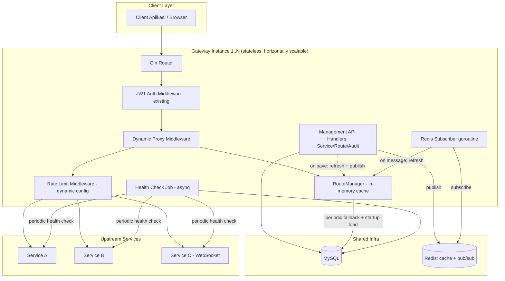
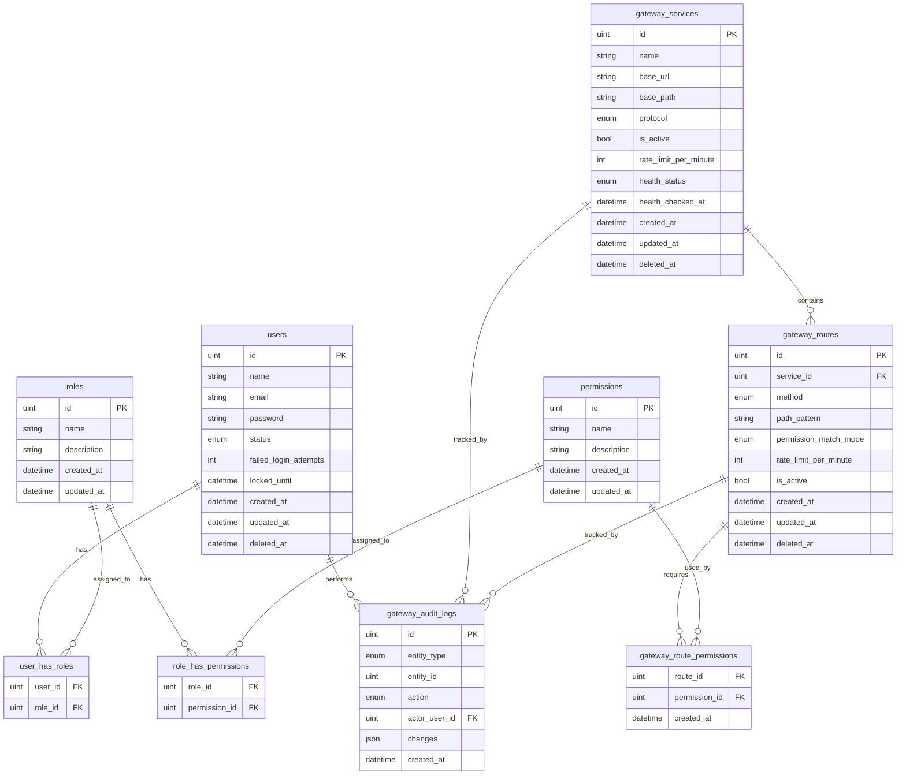

# 04 - Technical Design Document (TDD)

## API Gateway — Service & Route Management

---

## 1. Tech Stack

| Layer | Technology | Catatan |
|---|---|---|
| Backend Framework | Go + Gin | Sesuai base project (`gin-gonic/gin v1.12.0`) |
| ORM | GORM | Sesuai base project (`gorm.io/gorm`) |
| Database | MySQL | Sesuai base project (`DB_CONNECTION=mysql`) |
| Cache / Pub-Sub | Redis | Sudah `REDIS_ENABLED=true` di base project (`redis/go-redis/v9`), direuse untuk cache invalidation multi-instance |
| Background Job | Asynq | Sudah ada di base project (`hibiken/asynq`), direuse untuk Health Check scheduler |
| Auth | JWT RS256 | Sesuai base project, direuse tanpa perubahan |
| Proxy Mechanism | `net/http/httputil.ReverseProxy` (stdlib) | Menangani REST & WebSocket (auto connection-upgrade handling sejak Go 1.12) |
| Frontend Framework | Vue 3 + TypeScript | Sesuai base project |
| State Management | Pinia | Sesuai base project |
| Styling | Tailwind CSS | Sesuai base project |
| HTTP Client (FE) | Axios | Sesuai base project |
| Deployment | Docker container, portable ke Kubernetes/OpenShift (OCP) | Tidak bergantung API spesifik OCP (hindari `DeploymentConfig`/`Route` CRD eksklusif) |

---

## 2. System Architecture

---

## 3. Entity Relationship Diagram (ERD)

### Catatan Skema

- `gateway_services.base_path` **wajib & unik secara global** (`UNIQUE KEY`) — prefix path tetap milik Service ini (mis. `/order`), digabung dengan `gateway_routes.path_pattern` (relatif) saat matching (§2.13). Menjamin full path antar Service tidak pernah bentrok tanpa perlu pengecekan uniqueness lintas-service tambahan.
- `gateway_services.rate_limit_per_minute` **nullable** — `NULL` berarti pakai default global `.env` (`RATE_LIMIT_REQUESTS`/`RATE_LIMIT_WINDOW`).
- `gateway_routes.rate_limit_per_minute` **nullable** — `NULL` berarti fallback ke `rate_limit_per_minute` milik Service induk (yang juga bisa `NULL` → fallback ke default global). Resolusi berjenjang: **Route → Service → Global**.
- `gateway_routes.method` mendukung nilai `*` (semua method).
- `gateway_routes.path_pattern` mendukung 3 bentuk segmen: literal (`/user`), parameter dinamis (`:id`), wildcard (`*`, hanya boleh di posisi akhir path).
- `gateway_route_permissions` adalah join table murni many-to-many (tanpa kolom tambahan selain `created_at`), mengikuti pola `role_has_permissions` yang sudah ada di base project.
- `gateway_audit_logs.changes` bertipe JSON, isi bergantung `action`: `create`/`delete` → full snapshot record; `update` → `{"before": {...}, "after": {...}}` hanya kolom yang berubah.
- Semua tabel baru pakai soft-delete (`deleted_at`) kecuali `gateway_route_permissions` (junction, hard-delete on unassign) dan `gateway_audit_logs` (immutable, tidak ada delete sama sekali).
- **Delta pada tabel `users` existing** (bukan tabel baru): tambah kolom `status` (enum `active`/`suspended`, default `active`, NOT NULL), `failed_login_attempts` (int, default `0`, NOT NULL), `locked_until` (datetime, nullable). `status` (administratif, diubah manual admin) dan `locked_until`/`failed_login_attempts` (keamanan, diubah otomatis oleh alur login) adalah **dua mekanisme independen** — lihat FSD §2.25–§2.27.

---

## 4. API Contract

### §4.1 Existing Endpoints (Referensi, Tidak Berubah)

Modul Auth, User, Role, Permission, Notification, JWKS, Health, File sudah terdokumentasi di `be/docs/api-doc.md` — tidak diulang di sini.

> **Catatan penting (batas scope `gateway_routes`):** Endpoint bawaan Gateway sendiri — §4.1 di atas maupun §4.2–§4.5 (Service/Route/Gateway/Audit Management) — **tetap didaftarkan sebagai Gin route langsung di kode Go** (`internal/routes/*.go`), **bukan** sebagai baris di tabel `gateway_routes`. Hanya request yang diproxy ke upstream eksternal (§4.6, catch-all) yang diresolusi lewat `gateway_routes`/`RouteManager`. Ini disengaja: kalau endpoint manajemen (termasuk login & Route Management itu sendiri) ikut bergantung pada data routing dari DB, kegagalan/kekosongan data tsb bisa mengunci admin dari endpoint yang justru dibutuhkan untuk memperbaikinya. Mekanisme atomic-swap cache (§5 Konkurensi & Caching) karena itu hanya relevan untuk route proxy (§4.6), bukan untuk endpoint bawaan Gateway.

### §4.2 Service Management Endpoints

| Endpoint | Method | Auth Required | Permission | Request Payload | Success Response |
|---|---|---|---|---|---|
| `/api/services` | POST | Yes | `service.create` | `{name, base_url, base_path, protocol, rate_limit_per_minute?, is_active?}` | `201 {data: ServiceDTO}` |
| `/api/services` | GET | Yes | `service.index` | Query: `page, limit, search, protocol?, is_active?, health_status?` | `200 {data: ServiceDTO[], meta: pagination}` |
| `/api/services/:id` | GET | Yes | `service.index` | - | `200 {data: ServiceDTO}` (termasuk ringkasan Route di bawahnya) |
| `/api/services/:id` | PUT | Yes | `service.edit` | `{name?, base_url?, base_path?, protocol?, rate_limit_per_minute?, is_active?}` | `200 {data: ServiceDTO}` |
| `/api/services/:id` | DELETE | Yes | `service.delete` | Query opsional: `cascade=true` untuk hapus Route terkait | `200 {message: "Service deleted"}` |
| `/api/services/:id/health-check` | POST | Yes | `service.health-check` | - | `200 {data: {health_status, health_checked_at}}` |

### §4.3 Route Management Endpoints

| Endpoint | Method | Auth Required | Permission | Request Payload | Success Response |
|---|---|---|---|---|---|
| `/api/routes` | POST | Yes | `route.create` | `{service, method, path_pattern, permission_match_mode?, permissions?, rate_limit_per_minute?, is_active?}` | `201 {data: RouteDTO}` |
| `/api/routes` | GET | Yes | `route.index` | Query: `page, limit, service?, method?, is_active?` | `200 {data: RouteDTO[], meta: pagination}` |
| `/api/routes/:id` | GET | Yes | `route.index` | - | `200 {data: RouteDTO}` |
| `/api/routes/:id` | PUT | Yes | `route.edit` | `{method?, path_pattern?, permission_match_mode?, permissions?, rate_limit_per_minute?, is_active?}` | `200 {data: RouteDTO}` |
| `/api/routes/:id` | DELETE | Yes | `route.delete` | - | `200 {message: "Route deleted"}` |

> **Catatan:** `service` dan `permissions` di request payload berisi id (`service` = id Service tujuan, `permissions` = array id Permission) — suffix `_id`/`_ids` sengaja dihilangkan dari nama field request per konvensi v1.1.0 (response DTO tetap boleh pakai suffix `_id`/`_ids` apa adanya, mis. `service_id`, `permission_ids` di `RouteDTO`). Endpoint `POST /api/routes/:id/test` (Route Testing Tool) **dihapus** bersama fitur terkait (v1.1.0).

### §4.4 Gateway Runtime Endpoints

| Endpoint | Method | Auth Required | Permission | Request Payload | Success Response |
|---|---|---|---|---|---|
| `/api/gateway/cache/refresh` | POST | Yes | `route.create` OR `route.edit` (salah satu) | - | `200 {message: "Cache refreshed", refreshed_at}` |
| `/api/gateway/cache/status` | GET | Yes | `route.create` OR `route.edit` (salah satu) | - | `200 {data: {last_refreshed_at, total_services, total_routes, instance_id}}` |

> **Catatan:** Tidak ada permission `gateway.cache-refresh` — endpoint ini 1 URL dengan 2 kemungkinan permission (any-of), reuse `middleware.RequirePermission(acc, "route.create", "route.edit")` yang sudah ANY-of secara default.

### §4.5 Audit Trail Endpoints

| Endpoint | Method | Auth Required | Permission | Request Payload | Success Response |
|---|---|---|---|---|---|
| `/api/audit-logs` | GET | Yes | `audit.index` | Query: `page, limit, entity_type?, entity?, actor?, from?, to?` | `200 {data: AuditLogDTO[], meta: pagination}` |
| `/api/audit-logs/:id` | GET | Yes | `audit.index` | - | `200 {data: AuditLogDTO}` |

### §4.6 Dynamic Proxied Requests (Catch-all)

| Endpoint | Method | Auth Required | Permission | Request Payload | Success Response |
|---|---|---|---|---|---|
| `/*any` (semua path yang tidak match §4.1–§4.5) | Any | Yes (JWT Gateway standar) | **Dinamis** — diresolusi runtime dari `gateway_route_permissions` milik Route yang match (lihat FSD §2.13–§2.17); kosong = publik | Diteruskan apa adanya ke upstream | Diteruskan apa adanya dari upstream. Error khusus Gateway: `404` (no route match / service-route nonaktif), `403` (permission gagal), `429` (rate limit), `502` (upstream unreachable) |

### §4.7 User Status & Lock Endpoints (Delta Modul User Existing)

| Endpoint | Method | Auth Required | Permission | Request Payload | Success Response |
|---|---|---|---|---|---|
| `/api/users/:id/status` | PUT | Yes | `user.edit` | `{status}` (`active` atau `suspended`) | `200 {data: {id, status}}` |
| `/api/users/:id/unlock` | POST | Yes | `user.edit` | - | `200 {data: {id, locked_until: null}}` |

> **Catatan:** Endpoint login existing (`POST /api/auth/login`) tidak berubah kontraknya secara publik — perubahan hanya pada business logic internal (cek `status`/`locked_until` sebelum verifikasi password, lihat FSD §2.26 dan §5.5). Response error tetap `401` generik, tidak menambah field baru yang membocorkan alasan spesifik gagal login.

---

## 5. Infrastructure & Security

### Deployment

- Setiap instance Gateway bersifat **stateless** (state routing hanya cache in-memory + Redis, bukan lokal disk) — aman untuk horizontal scaling di Docker Compose (`--scale`), Kubernetes (Deployment + multiple replicas), maupun OpenShift (DeploymentConfig/Deployment, sama saja karena hanya container biasa).
- Tidak ada dependency ke fitur eksklusif OCP (Route CRD, ImageStream, dll) — cukup container image standar + environment variable, supaya portable murni ke Docker biasa kalau OCP tidak jadi dipakai.
- Redis dan MySQL adalah **shared infra** antar seluruh instance (bukan per-instance).

### Security

- Endpoint Management (§4.2–§4.5) mengikuti pola auth existing: JWT RS256 + `middleware.RequirePermission`.
- Endpoint proxy (§4.6) tetap wajib melewati JWT Auth Middleware existing sebelum masuk ke Dynamic Proxy Middleware — Gateway **tidak pernah** meneruskan request yang belum terautentikasi ke upstream manapun, termasuk untuk Route dengan `permission_ids` kosong (publik hanya berarti "tidak butuh permission tambahan", bukan "tanpa autentikasi"), kecuali secara eksplisit dikonfigurasi lain oleh kebijakan Auth di luar scope dokumen ini.
- `base_url` upstream tidak pernah diekspos di response ke client — hanya dipakai internal saat proxy.
- Redis Pub/Sub payload minimal (`{"type": "route_refresh", "triggered_at": ...}`), tidak membawa data sensitif.
- Rate limit dinamis tetap menghasilkan header standar `X-RateLimit-*`/`Retry-After` mengikuti pola middleware `ratelimit` existing.

### Konkurensi & Caching (RouteManager)

- `RouteManager` menyimpan slice route yang sudah di-load dari DB, dilindungi `sync.RWMutex` (pola sama seperti `helpers.Access` yang sudah ada di codebase — 2-tier: in-memory lokal + Redis sebagai broadcast layer, bukan sebagai penyimpanan utama data routing).
- Urutan resolusi saat startup: `Refresh()` sinkron sebelum server mulai menerima traffic (fail-fast kalau DB tidak bisa diakses saat startup) → baru start goroutine periodic ticker + Redis subscriber.
- **Refresh bersifat atomic swap, bukan clear-then-rebuild in-place:** `Refresh()` query seluruh Service+Route aktif dari DB, membangun slice/map route baru **sepenuhnya di variabel lokal terpisah** (tidak menyentuh cache yang sedang dipakai traffic), baru setelah build selesai sukses, menukar pointer cache aktif ke data baru tsb di bawah `mu.Lock()` (operasi penukaran pointer, bukan mutasi isi struktur lama). Konsekuensinya: **tidak pernah ada window waktu di mana traffic melihat cache kosong atau parsial** — baik saat refresh sukses (langsung tergantikan utuh) maupun saat refresh gagal (`err != nil` → log & keep existing cache lama, cache baru yang gagal dibangun dibuang, tidak pernah di-swap).
- Pola ini juga berarti route yang sudah aktif tidak pernah "hilang sesaat" akibat proses refresh yang sedang berjalan — client yang sedang request di tengah proses refresh akan selalu melihat salah satu dari dua kondisi valid: cache lama (utuh) atau cache baru (utuh), tidak pernah kondisi transisi/kosong.
- Setiap entri `CachedRoute` dalam cache menyimpan `PathPattern` (nilai relatif mentah dari DB, untuk logging/audit) terpisah dari `FullPath` (`service.base_path + route.path_pattern`, hasil gabungan yang benar-benar dipakai untuk membangun `segments` dan dicocokkan terhadap request masuk — lihat §2.13). Konkatenasi ini aman tanpa perlu normalisasi tambahan karena `base_path` divalidasi tidak pernah diakhiri `/` dan `path_pattern` divalidasi selalu diawali `/`.

### Observability

- Health Check job memakai `asynq` scheduler existing, interval dikonfigurasi via `.env` baru: `GATEWAY_HEALTHCHECK_INTERVAL_SECONDS` (default `60`).
- Cache refresh periodic interval dikonfigurasi via `.env` baru: `GATEWAY_CACHE_REFRESH_INTERVAL_SECONDS` (default `60`).
- Redis Pub/Sub channel name dikonfigurasi via `.env` baru: `GATEWAY_REFRESH_CHANNEL` (default `gateway:route:refresh`).
- User Account Lock threshold dikonfigurasi via `.env` baru: `AUTH_MAX_FAILED_LOGIN_ATTEMPTS` (default `5`) dan `AUTH_LOCK_DURATION_MINUTES` (default `15`).
